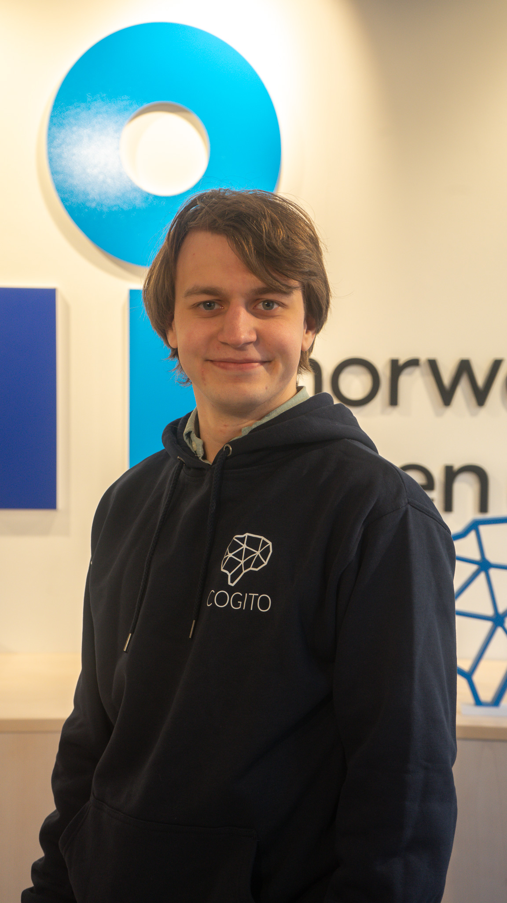

# NEATtactics

<div align="center">


[](https://opensource.org/licenses/MIT)
[](https://img.shields.io/badge/version-0.0.1-blue)


</div>

<details> 
<summary><b>📋 Table of contents </b></summary>

- [NEATtactics](#neattactics)
  - [Description](#description)
  - [Getting started](#getting-started)
    - [Note on venv](#note-on-venv)
    - [Prerequisites](#prerequisites)
  - [Usage](#usage)
  - [Testing](#testing)
    - [Test execution environment](#test-execution-environment)
  - [Team](#team)
    - [License](#license)

</details>

## Description

NEATtactics is a project that aims to implement the NEAT (NeuroEvolution of Augmenting Topologies) algorithm to train a neural network to play a classic platformer game inspired by Super Mario. The idea is to evolve a neural network using NEAT, allowing an AI agent to learn and improve its gameplay strategies over time, starting from scratch and evolving through generations.

Our project takes inspiration from SethBling's MarI/O video, where he demonstrates a neural network learning to play Super Mario World using the NEAT algorithm. You can watch the video [here](https://www.youtube.com/watch?v=qv6UVOQ0F44) [here] (https://www.youtube.com/watch?v=CI3FRsSAa_U&t=468s) to get a better understanding of the principles behind our approach.

To implement this, we are basing our work on the [research paper](https://nn.cs.utexas.edu/downloads/papers/stanley.cec02.pdf) "Evolving Neural Networks through Augmenting Topologies" by Kenneth O. Stanley and Risto Miikkulainen. This paper introduces the NEAT algorithm, which evolves neural network topologies along with weights to create more efficient and sophisticated solutions.

In this project, we will:

- Implement the NEAT algorithm from scratch, following the guidelines from the original research paper.
- Use a simulation environment based on a classic Super Mario platformer where our AI agent will learn to navigate and play the game.
- Continuously evolve the agent's neural network to enhance its performance, aiming for progressively better gameplay as it learns from experience.

Join us in exploring the fascinating world of neuroevolution and AI-driven gameplay!

## Getting started
<!-- TODO: In this Section you describe how to install this project in its intended environment.(i.e. how to get it to run)  
-->

Start off by cloning the repository to your local machine.

```bash
git clone https://github.com/CogitoNTNU/NEATactics
```

Next, navigate to the project directory:

```bash
cd NEATtactics
```

Create a virtual environment to manage the project dependencies:

```bash
python -m venv venv
```

Activate the virtual environment on Mac/Linux:

```bash
source venv/bin/activate
```
Alternatively use this command on windows:

```bash
venv\Scripts\activate
```
Install the project dependencies:

```bash
pip install -r requirements.txt
```

Now you are ready to run the project!

### Note on venv

You will need to activate the virtual environment for each new shell session.
If you want to deactivate the virtual environment, you can do so by either closing the terminal or
running the following command:

```bash
deactivate
```

### Prerequisites

- Ensure that git is installed on your machine. [Download Git](https://git-scm.com/downloads)
- Ensure that you are using python version==3.8.x. [Download Python](https://www.python.org/downloads/)

## Usage

To run the project, run the following command from the root directory of the project:

```bash
python main.py
```
<!-- TODO: Instructions on how to run the project and use its features. -->

## Testing

To run the test suite, run the following command from the root directory of the project:

```bash
pytest
```

To get a detailed report of the test coverage, run the following commands:

```bash
coverage run --source=src -m pytest
coverage html
```

Next, open the `htmlcov/index.html` file in your browser to view the
detailed coverage report. In linux and Mac, you can use the following command:

```bash
open htmlcov/index.html
```

You might want to clean up the coverage files before running the tests again. To do this, run the following commands:

```bash
coverage erase
rm -rf htmlcov
```

### Test execution environment

When first installing the project, it is advised to run the following tests:

```bash
pytest -m "environment"
```

Which will check for CUDA compatibility and the current OS.
Specifically, if you are running on Windows, you might have troubles installing the `gym_super_mario_bros` package.

## Team

This project would not have been possible without the hard work and dedication of all of the contributors. Thank you for the time and effort you have put into making this project a reality.

<table align="center">
    <tr>
        <td align="center">
            <a href="https://github.com/ChristianFredrikJohnsen">
              <br />
              <sub><b>Christian Fredrik</b></sub>
            </a>
        </td>
        <td align="center">
            <a href="https://github.com/BrageHK">
              <br />
              <sub><b>Brage</b></sub>
            </a>
        </td>
        <td align="center">
            <a href="https://github.com/kristiancarlenius">
              <br />
              <sub><b>Kristian</b></sub>
            </a>
        </td>
        <td align="center">
            <a href="https://github.com/ludvigovrevik">
              <br />
              <sub><b>Ludvig</b></sub>
            </a>
        </td>
        <td align="center">
            <a href="https://github.com/kapi0okapi">
              <br />
              <sub><b>Kacper</b></sub>
            </a>
        </td>
        <td align="center">
            <a href="https://github.com/Vetlets05">
              <br />
              <sub><b>Vetle</b></sub>
            </a>
        </td>
        <td align="center">
            <a href="https://github.com/Hako2807">
              <br />
              <sub><b>Håkon</b></sub>
            </a>
        </td>
    </tr>
</table>


### License

------
Distributed under the MIT License. See `LICENSE` for more information.
