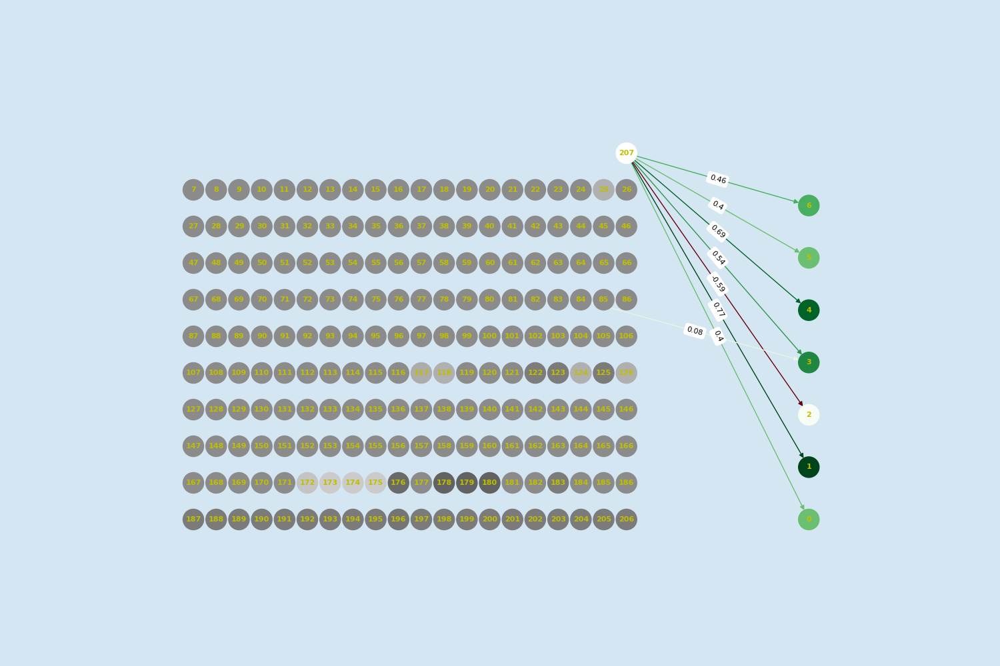

# Visualization

- [Visualization](#visualization)
  - [Purpose](#purpose)
  - [Structure](#structure)
  - [Sample visualization](#sample-visualization)

## Purpose

Our neural network is so small that it is feasible to visualize the entire neural network structure.
It is cool to watch how the neural network evolves, and it is also useful for debug purposes.

## Structure

- `colors_visualization.py`: Responsible for providing the correct colors for nodes and weights. Colors are determined by looking at weight/node values.
- `visualization_position_utils.py`: Responsible for giving the nodes their positions in the nxgraph canvas.
- `visualize_genome.py`: Main file, responsible for creating a picture visualizing the neural network, provided a genome as input.
- `viz_config.py`: Contains a bunch of constants which are relevant for how the nodes are positioned in the nxgraph canvas.

## Sample visualization

